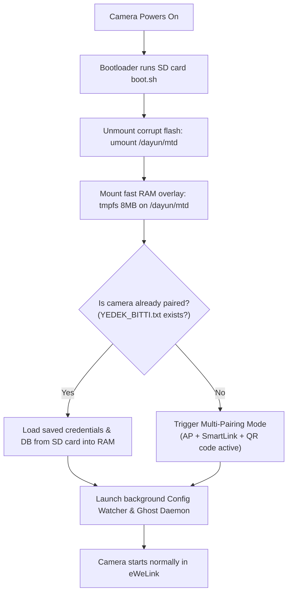

# 📹 Sonoff GK-200MP2-B/C — Permanent SD Card Boot & Unbrick Fix

[](https://github.com/Mucid19/Sonoff-GK-200MP2-B-C-)
[](README.md)
[](README_TR.md)
[](LICENSE)
[](https://bitcoin.org)

> **Reset button not working? eWeLink pairing failing? JFFS2 CRC errors on serial console?**  
> This project provides a zero-soldering, 100% software-based permanent bypass fix for **Sonoff GK-200MP2-B / GK-200MP2-C** IP cameras suffering from worn-out or locked onboard SPI flash chips.

📖 **[Türkçe Dokümantasyon için buraya tıklayın (README_TR.md)](README_TR.md)**

---

## 📌 The Problem

On many Sonoff GK-200MP2-B and GK-200MP2-C cameras, the onboard **Winbond W25Q64** SPI flash memory chip degrades physically over time due to continuous write cycles or write-protection lock issues.

When this occurs:
* 🔴 **Reset button fails:** Pressing the physical reset button triggers the GPIO line, but the reset routine fails to clear or rewrite configuration files on the damaged flash sectors.
* 🔴 **eWeLink pairing loop:** Even if you delete the device from the eWeLink app, it cannot be re-paired or retain new WiFi credentials.
* 🔴 **JFFS2 CRC Errors:** Serial console output displays repeated filesystem corruption warnings:
  ```text
  Node CRC ffffffff != calculated CRC xxxxxxxx
  Empty space found at 0x...
  ```
* 🔴 **Stale/Corrupt Credentials:** On every reboot, the camera reloads corrupted or outdated credentials from the bad chip sectors, failing to join your network.

---

## 💡 The Solution

Instead of desoldering and replacing the SOIC-8 flash chip, this solution **completely bypasses the degraded SPI flash filesystem (`/dayun/mtd`)** and turns any standard FAT32 MicroSD card into the camera's persistent storage.

On every boot, the camera unmounts the broken flash partition, mounts an 8MB RAM-based `tmpfs` overlay, loads known-good configuration data from the SD card, and runs smoothly without ever touching the corrupt flash memory.

---

## ⚙️ How It Works



1. **Boot Interception:** The camera firmware checks the MicroSD card on boot and automatically executes `boot.sh`.
2. **Flash Bypass:** The corrupted JFFS2 partition (`/dayun/mtd`) is cleanly unmounted with `umount /dayun/mtd`.
3. **RAM Overlay:** A fast 8MB RAM disk (`mount -t tmpfs -o size=8M tmpfs /dayun/mtd`) is mounted in its place.
4. **Credential Injection:**
   * **First Boot:** Cleans stale WiFi configurations and activates tri-mode pairing (**AP Mode + SmartLink + QR Code scanning** all active simultaneously).
   * **Subsequent Boots:** Restores your saved WiFi credentials and camera settings from the SD card into RAM.
5. **Ghost Mode (In-App Format Resilience):**
   * A persistent background daemon keeps a ghost copy of `boot.sh` in `/tmp`.
   * If you format the MicroSD card from within the eWeLink app, the daemon immediately detects the missing files and **re-writes `boot.sh` and your configuration backups back to the SD card within seconds**, preventing accidental bricking!
6. **Live Config Sync:** Any setting changes made via the eWeLink app (stream quality, motion detection, night mode, etc.) are automatically detected by an inotify/state watcher and saved back to the SD card.

---

## 🛠️ Step-by-Step Installation

### Requirements
* Any standard MicroSD card (FAT32 formatted, 2GB to 128GB).
* A computer to copy `boot.sh` onto the SD card.
* The official **eWeLink** mobile app.

---

### Step 1: Copy `boot.sh` to MicroSD Card
1. Format your MicroSD card with **FAT32** filesystem.
2. Copy [`boot.sh`](boot.sh) directly to the **root directory** of the MicroSD card:
   ```text
   SD Card Root (E:\ or /media/sdcard/)
   └── boot.sh
   ```

---

### Step 2: First-Time Pairing
1. Ensure the camera is powered **OFF**.
2. Insert the MicroSD card containing `boot.sh` into the camera's SD slot.
3. Power **ON** the camera.
4. The camera will automatically enter pairing mode (audio prompt in English).
5. Open the **eWeLink** app, tap **Add Device**, and follow the on-screen instructions (QR code scanning or Sound/AP pairing).
6. ⏳ **CRITICAL STEP:** Once pairing is complete and the camera appears online in the app, **leave the camera powered on for at least 3 minutes**.
   * The background daemon performs 6 redundant sync cycles to ensure all database files and authentication tokens are properly written to `kamera_yedek/`.
   * When `kamera_yedek/YEDEK_BITTI.txt` appears on the SD card, the backup is complete.
7. Your camera is now fully functional!

---

### Step 3: Regular Operation
* From this point on, simply power the camera on with the SD card inserted. It will automatically connect to your WiFi and boot into eWeLink within seconds.

---

## ⚠️ Important Notes & Best Practices

* ⚠️ **Keep the SD Card Inserted:** The camera relies on the SD card for persistent configuration. If powered on without the SD card, it will fall back to the corrupt onboard flash chip and will not connect.
* ⚠️ **Backup Your SD Card:** Once pairing is complete, make a backup of the SD card (`boot.sh` + `kamera_yedek/` directory) to your computer.
* ⚠️ **Formatting SD Card from eWeLink App:**
  * If you format the SD card via the eWeLink app menu, **WAIT at least 3-4 minutes before rebooting or powering off**.
  * The internal daemon will detect the format, recreate `kamera_yedek/`, restore `boot.sh`, and resync your settings. Powering off during this window may require recopying `boot.sh` manually from a PC.

---

## 🔬 Hardware Specifications

| Component | Model / Details |
| :--- | :--- |
| **SoC (CPU)** | GOKE GK7102S (ARM926EJ-S @ 600MHz) |
| **CMOS Sensor** | GalaxyCore GC2053 (2MP 1080p FHD) |
| **WiFi Chipset** | Realtek RTL8188FU / RTL8192EU (802.11 b/g/n) |
| **SPI Flash** | Winbond W25Q64JV (8MB, SOIC-8, 3.3V) |
| **Target Firmware** | `fw_version=5520.2053.0402build20220712` (and compatible variants) |
| **Filesystem** | JFFS2 on MTD / Overlaid with `tmpfs` |

---

## ☕ Support & Donations

If this unbrick solution saved your camera from the trash bin and you'd like to support open-source reverse engineering and hardware repair, donations via Bitcoin are greatly appreciated:

### 🪙 Bitcoin (BTC) Donation Address:
```text
bc1qxf5cfrxasshlkt79x0q805l9t3feer868en68nhlxmwetlr6sv4qdfda5s
```

*Thank you for your support!*
